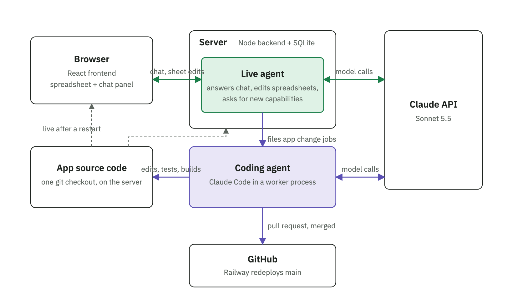

# Sheets

A web spreadsheet app, similar to Google Sheets, that also makes slide decks and text documents. Users register and sign in with email and password (verified by an emailed link) or with Google, and can create, open, rename and delete spreadsheets. Each spreadsheet has multiple tabs and supports formulas, formatting, sorting and filtering.

A built-in assistant (the live agent) answers chat and edits spreadsheets. When it lacks a capability, a coding agent changes the app's own code, restarts it and publishes the change as a merged pull request. See [Self-improvement](#self-improvement).



## Running

```sh
npm install
npm run dev        # API on :3001 and Vite on :5173; open http://localhost:5173
npm test           # formula engine, spreadsheet operations and API tests
npm run typecheck
npm run build && npm start   # production: serves dist/client and the API on :3001
```

Requires Node 22.18+. The server runs TypeScript directly through Node's built-in type stripping and uses the built-in `node:sqlite`.

## Desktop app

The same app runs on your machine with a folder as its library, in Electron (`desktop/`):

```
npm run desktop                 # build the client, then open the current directory
npm run desktop -- ~/Documents  # or a folder you name
npm link                        # once, to get the `freeflow` command:
cd ~/Documents && freeflow      # open the directory you are in (after `npm run build`)
```

The folder's files are the file list and its directories are the library's folders (see Folders below; hidden entries and `node_modules` are skipped). A file's name in the list is its file name without the extension. **File → Open Folder…** switches to another folder. There is no account and nothing to sign in to.

- Markdown (`.md`) and CSV (`.csv`) files open in their editors and are saved back as the plain text they are.
- New spreadsheets, presentations and documents are saved in the folder as `.ffsheet`, `.ffslides` and `.ffdoc` files (the app's JSON formats). A CSV file that is converted to a spreadsheet becomes a `.ffsheet` file.
- PDFs and images open in a preview, and videos (`.mp4`, `.m4v`, `.mov`, `.webm`, `.ogv`) in a player. Excel, PowerPoint and Word files are listed and are not edited in place: **Open as spreadsheet** (or presentation, document) saves an editable copy next to the original.
- Renaming a file in the app renames it on disk, and **Move to…** moves it into another directory. Deleting moves the file out of the folder into the app's data directory (`trash/`), not the system trash.
- A file changed by another program while it is open in the app is not overwritten: the save is refused.

The app's own data for a folder (the assistant's chat, settings, pasted images, branch snapshots, deleted files) is kept under Electron's user data directory (`~/Library/Application Support/FreeFlow Docs/folders/` on macOS), not in the folder. Images pasted into a file are therefore not part of the file. The assistant uses `ANTHROPIC_API_KEY` from the environment or the project's `.env`, or an OpenAI key from Settings. On macOS the `freeflow` command starts the app through LaunchServices, so the app itself (listed as Electron until it is packaged) is what macOS asks about and grants access to Downloads, Documents and Desktop, not the terminal; a folder it may not read shows a message saying so. The app talks to a server it starts on a loopback port (`desktop/server.ts`), which only answers the app's own windows.

### Packaging

`npm run desktop:win` builds the Windows app with electron-builder into `release/`: an installer (`FreeFlow Docs Setup <version>.exe`) and a zip of the same files, both for x64. It can be run on macOS; without Wine the `.exe` keeps Electron's icon and is not code-signed, so Windows shows its "unknown publisher" warning on first run. `npm run desktop:pack` builds the unpacked app for the machine it runs on, to try the packaged layout.

The packaged app holds the server's TypeScript as plain files (`asar` is off), which Electron's Node runs as it does in development. Started from its icon it reopens the folder it showed last, or asks for one the first time; a folder can also be given on its command line. It reads no `.env`: the assistant needs `ANTHROPIC_API_KEY` in the environment or an OpenAI key in Settings.

## Videos

A video file (`.mp4`, `.m4v`, `.mov`, `.webm`, `.ogv`) opens in a page with the browser's player. On the web, import one from the home page (the Import tile or a drop, 100 MB maximum); it is stored as the file it is, like a PDF. The server answers Range requests for stored files, so the player can seek without downloading the whole file. Whether a file plays depends on its codec: H.264 and VP8/VP9 play everywhere, while HEVC (the default of recent iPhones) does not play in every browser.

## Folders

The file list shows one folder at a time. **New folder** creates one inside the folder being shown, clicking a folder opens it, and the breadcrumbs over the list lead back up; the folder is part of the address (`/?folder=Reports/2026`). New and imported files go into the folder being shown, **Move to…** in a file's menu moves it, and a folder can be deleted once it is empty. Typing anywhere on the page filters the folder being shown; **Find files**, under the filtered list, looks for the same text in the names of files and folders in every folder (`GET /api/library/search?q=`) and shows where each match is. In the desktop app that walks the mounted folder level by level for up to a minute, and says so when a very large tree could not be covered; with a home directory mounted, its `Library` is left out. The search is part of the address too (`&q=plan`, and `&find=1` for Find files), and an open file's logo and breadcrumb links lead back to the list as it was, so the same results are there after looking at a file. Folders cannot be renamed or moved yet, and the assistant lists and creates files without regard to folders (what it creates lands at the top).

The switch over the files shows them as a list or as thumbnails (remembered per browser). A thumbnail is the image itself, a frame of a video, the first page of a PDF (drawn by pdf.js, loaded only then), or a small rendering of how a document, spreadsheet or presentation starts (`shared/preview.ts`, `GET /api/library/preview/:id`); each is fetched when its card scrolls into view. Excel, PowerPoint and Word files show an icon.

Clicking a file opens it in place, inside its folder: the page header shows the folders down to the file as breadcrumbs, each a link back to the file list there. The **Open ↗** button on a row opens the file in a new browser tab instead; in the desktop app that is a new tab of the window (macOS) or a new window.

On the server a folder is a row (`folders` table, `server/folders.ts`) and each file records the path of its folder; in the desktop app folders are the directories of the mounted folder. `GET /api/library?folder=` returns a folder's folders, documents and stored files.

## Self-improvement

When the assistant can't do something, it offers to add the capability to the app. If the user agrees, it calls `request_app_change` with a spec, the user confirms in the panel, and after the reply ends the server starts a detached worker (`server/agent/worker.ts`) that runs Claude Code in the repository through the Claude Agent SDK. Claude Code reads `CLAUDE.md` (which explains how to add an assistant tool), makes the change, and runs typecheck and tests; the worker verifies both again. When the change is live the browser reloads and sends the assistant a message with the summary, and it finishes the original request with its new tool.

Screenshots: paste, drop or attach images (PNG, JPEG, GIF, WebP; up to four per message) in the chat and the assistant sees them, for example to transcribe a table from a screenshot into the sheet. Images are downscaled in the browser and stored with the conversation.

The assistant can also hand off **research**: `request_research` queues a job that runs Claude Code in a scratch folder with web search and read-only tools (never the app's code), optionally with the open spreadsheet exported as CSV, and its report comes back to the conversation as a message so the assistant can act on it, for example by writing results into the sheet. Research jobs appear on the Changes page with their report and cannot be reverted.

Every job is a record of the change (request, the coding agent's summary, files, cost, pull request) in the `agent_jobs` table, listed on the **Changes** page (`/changes`), where any finished change has a **Revert** button. A revert is a job that applies the change's patch in reverse (or asks the coding agent to undo it when the code has moved on) and goes through the same checks, restart and publishing. One job runs at a time; full Claude Code output is in `data/jobs/<id>.log`.

- **Local development**: the dev server restarts and Vite hot-reloads as files change. Without `GITHUB_TOKEN` the change is left uncommitted in the working tree for review.
- **Production (Railway)**: the app edits its own source in the container. The worker makes the source tree a git checkout of the deployed commit (`RAILWAY_GIT_COMMIT_SHA`), runs Claude Code, verifies, rebuilds the client (`npm run build`), asks the server to restart (`npm start` runs `server/supervise.ts`, which restarts it on exit code 75), then commits the job's files plus an entry in `CHANGELOG.md` on a branch, pushes it, opens a pull request and squash-merges it. Railway then redeploys main with the same code. Needs `GITHUB_TOKEN` (a fine-grained token with Contents and Pull requests read/write on the repo) and, if not deploying from GitHub, `GITHUB_REPO=owner/name`. The image needs git and the dev dependencies: `RAILPACK_DEPLOY_APT_PACKAGES=git` and `RAILPACK_PRUNE_DEPS=false` (set in `.railway/railway.ts`).

Password reset: **Forgot your password?** on the sign-in page emails a one-time link (valid for an hour) that opens `/reset` to set a new password and signs the user in; other sessions are signed out. Email goes through Cloudflare Email Service when `CLOUDFLARE_ACCOUNT_ID` and `CLOUDFLARE_API_TOKEN` are set (`MAIL_FROM` must then be an address on a domain verified for sending in that account), else through Resend when `RESEND_API_KEY` (and optionally `MAIL_FROM`) is set; otherwise the message, link included, is written to the server log, so on a single-operator deployment the link can be copied from the Railway logs.

Email verification: a password sign-up gets no session until the link in the verification email (valid 24 hours) is opened at `/verify`; signing in before that is refused with a "send it again" option, and signing up again with the same address just replaces the password and resends the link. Opening a password reset link also verifies the address. Accounts that existed before verification was added count as verified.

Google sign-in: with `GOOGLE_CLIENT_ID` and `GOOGLE_CLIENT_SECRET` set (an OAuth web client whose authorised redirect URIs include `<APP_URL>/api/auth/google/callback`), the sign-in and registration pages show **Continue with Google**. The first Google sign-in links to an existing verified account with the same email, takes over an unverified one (its password stops working, since whoever set it never proved they own the address), or creates a new one with no password (set one later with **Forgot your password?**). `APP_URL` sets the origin used in the link (defaults to the requesting origin). `LEGACY_HOSTS` lists old host names (comma-separated) that redirect to `APP_URL` with the same path, for moving the app to a new domain.

Environment variables: `PORT` (default 3001), `HOST` (default 127.0.0.1), `DATA_DIR` (default `./data`), and `SECURE_COOKIES=1` for HTTPS deployments. The assistant needs `ANTHROPIC_API_KEY`. For local development, copy `.env.example` to `.env` (git-ignored) and fill it in; the server loads it on start (`server/env.ts`), so restart it after editing. You can also set `AGENT_MODEL` (`claude-sonnet-5-5` by default, or `claude-opus-5-5`), `AGENT_EFFORT` (`low`, `medium` (default) or `high`) and `AGENT_DAILY_REQUEST_LIMIT` (model calls per user per day, default 500). The coding and research jobs run Claude Code with the same key and its default model unless `CODING_API_KEY` (a separate API key, or a Claude Code OAuth token from `claude setup-token`, billed apart) or `CODING_MODEL` (a model id to pin) is set.

## Layout

| Path | Contents |
| --- | --- |
| `shared/` | Workbook types, A1 helpers, value parsing and formatting, and the formula engine (tokenizer, parser, dependency-tracking evaluator, ~120 functions). Used by both client and server. |
| `server/` | Fastify API: auth (scrypt password hashes, hashed session tokens in httpOnly cookies) and sheet CRUD. |
| `client/src/state/` | `WorkbookStore` (patch-based undo/redo, incremental recalculation), `AutoSaver`, spreadsheet operations (`ops.ts`) and `SheetController` (selection, editing, clipboard and commands). |
| `client/src/grid/` | Canvas grid: virtualized rendering, frozen panes, hit testing, and the mouse and keyboard interaction. |
| `client/src/deck/`, `client/src/doc/` | The presentation and document editors (stores with undo/redo, controllers, views and toolbars). |

## Assistant

**Assistant** in the header (or **⌘K** / **Ctrl+K**) opens a chat panel on the right. You can ask it in plain language to read, edit, format, sort or restructure the open spreadsheet, or to find, read, create and open other spreadsheets. It knows which spreadsheet, tab and selection you're looking at. It uses Claude Sonnet 5.5 by default (`AGENT_MODEL` switches it, for example to Opus 5.5) through one API key on the server. Under **Settings** (in the More menu on the home page) a user can instead enter their own OpenAI API key and pick a model (Astra, Sol or Luna); their assistant then runs on that key, is billed to them, and is not counted against the daily limit.

- **Edits appear immediately** and save like your own. Everything the assistant changes for one message undoes as a single step with ⌘Z. Deleting tabs, rows or columns, and clearing more than 100 cells, asks you first.
- **One ongoing conversation per user**, kept across page loads and navigation. **New chat** starts over (old conversations stay in the database).
- Click an action in the chat (such as "Wrote 8 cells at A1") to select that range.

How it works:

- The **server** (`server/agent/`) runs the agent loop and holds the API key, system prompt and tools. Conversations are stored in SQLite exactly as sent to the API and are only ever appended to. That keeps prompt caching effective and lets the model's thinking blocks be passed back unchanged.
- **Account tools** (`list_sheets`, `read_other_sheet`, `create_sheet`) run on the server.
- **Sheet tools** (`read_range`, `write_range`, `format_range`, `sort_range`, `open_sheet` and the others) run in the **browser**, on the live spreadsheet (`client/src/agent/clientTools.ts`). That way edits recalculate, render, autosave and undo like any other edit. When Claude calls one, the server streams the call to the browser and pauses. The browser runs it and posts the result back, and the loop continues.
- Every request carries the current context: the page, the spreadsheet, its tabs, the active tab and the selection. It's added in front of the user's message, so the system prompt stays cacheable.
- Tool inputs are checked against Zod schemas (`server/agent/tools.ts`) before anything runs. The same schemas generate the JSON Schema sent to Claude.

## Presentations

**Blank presentation** on the home page creates a slide deck (`/d/<id>`). A slide is a fixed 960×540 canvas (PowerPoint's 16:9 size) holding text boxes, images and shapes (rectangles, ellipses, triangles, diamonds, polygons, stars, arrows, chevrons, speech bubbles, hearts and lines; the table in `shared/shapes.ts` also maps each one to its PowerPoint preset). Slides are made from **layouts** (title, section header, title and body, two columns, title and image, blank), and a deck has a **theme** (light, dark, ocean, forest, sunset, paper) that sets its colors and fonts.

- Click a slide in the strip on the left to edit it; drag to reorder; right-click for slide commands. Double-click a text box or shape to edit its text; **Tab** indents a bullet. Drag elements to move them and use the handles to resize (corner handles keep an image's aspect ratio). Arrow keys nudge, **Delete** removes, ⌘D duplicates, ⌘C/⌘V copy and paste elements, and ⌘Z undoes.
- **Insert → Image…**, dropping an image file on the slide, or pasting one adds an image element (stored like cell images).
- **Present** (F5) shows the deck full screen; arrow keys and clicks move between slides, **N** shows the speaker notes and the next slide, and Esc leaves.
- **File → Download as PowerPoint (.pptx)** exports the deck (text with bullets, images, shapes, backgrounds and notes) with pptxgenjs in the browser; **File → Print / Save as PDF…** lays out one slide per page.
- **PowerPoint import**: drop a `.pptx` on the home page (or use the Import tile) to create a presentation from it, or **File → Import PowerPoint slides…** inside a deck to add its slides after the current one. The conversion runs on the server (`server/pptxImport.ts`) and keeps text boxes with bullets, per-paragraph sizes, weights and colors, fonts, line and paragraph spacing, alignment and insets, theme colors, translucent fills and outlines, pictures (PNG, JPEG, GIF, WebP), shapes (text on a filled shape becomes a text element on top of it), horizontal and vertical lines, solid slide backgrounds and speaker notes. Fonts that are on Google Fonts (Inter, Poppins, Montserrat, ...) are loaded when a deck uses them. Tables, charts, SmartArt, other picture formats, gradients and picture backgrounds are dropped and listed in a banner.
- Speaker notes live under the slide.

The assistant edits presentations too: `read_deck`, `add_slides` (layout plus plain content), `update_slide` (change the title, body, notes or layout of one slide), `edit_elements` (move, resize, restyle, add or remove elements), `delete_slides`, `move_slide` and `set_deck_theme` run in the browser against the open deck, and `list_decks`, `create_deck` (optionally with all its slides) and `open_deck` find, create and open decks. "Turn this spreadsheet into a short presentation" reads the sheet, creates the deck and opens it.

Decks are stored like spreadsheets (`shared/deck.ts` is the format; the `sheets` table has a `kind` column) and are listed with them on the home page. Branches and compare are for spreadsheets only.

## Documents

**Blank document** on the home page creates a text document (`/doc/<id>`): a WYSIWYG editor for writing, built on ProseMirror. A document is a sequence of blocks (paragraphs, a title and subtitle, headings, bulleted and numbered lists, quotes, code blocks, images and horizontal rules) whose text can be bold, italic, underlined, struck through, code, linked, colored or highlighted, set in another font or size (the toolbar lists system fonts and a set loaded from Google Fonts), and aligned left, center, right or justified.

- The toolbar and the **Format** menu set the paragraph style and text formatting; the usual shortcuts work (⌘B/I/U, ⌘⇧X strikethrough, ⌘E code, ⌘K link, ⌘⇧7/8 lists, ⌘⌥0–3 paragraph and headings, ⌘⇧L/E/R/J alignment, Tab and ⇧Tab to indent list items). Typing `# `, `- `, `1. `, `> `, ```` ``` ```` or `---` at the start of a line turns it into the matching block, and a web address followed by a space or Enter becomes a link.
- **Insert → Image…**, pasting or dropping an image adds an image block (stored like cell images); drag its corner handle to resize it, and use the alignment buttons to place it. Clicking into a link shows a small card with the address (click it to open in a new tab), Edit and Remove; ⌘-click a link to open it directly.
- Every edit is a command (a ProseMirror transaction whose steps know how to invert themselves), recorded by `DocStore` (`client/src/doc/store.ts`): ⌘Z undoes a run of typing, or everything the assistant changed for one request, as a single step. Changes save automatically.
- **File** downloads the document as Markdown or as a web page, or prints it (Save as PDF).
- **Document style** (Format → Document style…): the default font, body size, line spacing and space after paragraphs, stored on the document and used by all text without a font or size of its own; headings scale with the body size. Format → Line spacing sets the spacing of the selected paragraphs.
- **Pages**: a document is paginated by default (View → Pages; View → Pageless gives one continuous column). Format → Page setup… sets the paper size (Letter, Legal, A4), orientation, margins, page numbers, and a header and footer (`{page}` and `{pages}` are replaced). Insert → Page break (⌘⏎) starts a new page. The editor stays one continuous column; `client/src/doc/pagination.ts` measures where lines and blocks land and inserts spacer decorations at page boundaries (whole images and rules move, paragraphs split between lines, and headings stay with the block after them), and the page frames, numbers, header and footer are drawn from the same result. Printing in Pages mode lays out one page per sheet from the same measurements, so the printout matches the screen. View → Zoom fits the page to the window or sets a percentage. A rail on the left shows a thumbnail of every page with the current page highlighted; click one to jump to it, drag its edge to resize it, and collapse it with the arrow (or View → Page thumbnails).
- **Word import**: drop a `.docx` on the home page (or use the Import tile) to create a document from it, or **File → Import Word document…** inside a document to add its content after the cursor. The conversion runs on the server (`server/docxImport.ts`) and keeps the document's default font, size, line and paragraph spacing (as the document style), paragraph styles (title, subtitle, headings, quotes) with their fonts and sizes, paragraph spacing, bulleted and numbered lists with nesting, bold, italic, underline, strikethrough, colors, highlights, fonts and sizes, hyperlinks, line breaks, page breaks, pictures, and the page size, orientation and margins. Tables become one paragraph per row; headers, footers, footnotes, comments, charts and SmartArt are dropped and listed in a banner.

The assistant edits documents too. It sees a document as numbered blocks in Markdown (`read_doc`) and writes Markdown back: `insert_content`, `replace_blocks` and `delete_blocks` work on whole blocks, `replace_text` changes words in place, `format_text` makes text bold, italic, underlined, colored, highlighted or a link without retyping it, `format_blocks` changes a block's kind or alignment, `insert_image` adds a picture, `set_page_setup` changes the page setup, `set_doc_style` changes the document's default font, size and spacing, and `\newpage` in Markdown is a page break. `list_docs`, `create_doc` (with the content as Markdown), `read_other_doc` and `open_doc` find, create, read and open documents. Deleting blocks, or replacing ten or more at once, asks for confirmation.

The file format (`shared/doc.ts`) is the ProseMirror JSON of the document under a schema that is the single definition of what a document may contain; `shared/docMarkdown.ts` converts documents to and from Markdown (plus `# text {.title}`, `## text {.subtitle}`, `<u>`, `<mark>` and `<span style="color: …; font-family: …; font-size: 14pt">` for what Markdown cannot say), and the server validates every save against the schema.

## Branches

**File → Create branch…** (or **Create branch** in a spreadsheet's menu on the home page) makes a branch: a copy you can edit freely that stays connected to its original. Branches are listed under their original on the home page.

In a branch, **Compare with original** opens a three-way comparison. When the branch is created, a snapshot of the original is saved as the *base* (`data/sheets/<id>.base.json`). Each difference is then labeled by who made it:

- **Yours** (green): changed in your branch since it was created.
- **Original** (purple): changed in the original since then.
- **Conflict** (red): changed differently on both sides. Identical changes on both sides don't show.

Changed cells are tinted on the grid, and hovering one shows the base, your and the original's values. Rows that exist only on the other side are drawn as a line where they would be. The side panel lists every change; click one to jump to it. The comparison updates as you edit, and **↻** fetches the original's latest state.

How the comparison works (`shared/diff.ts`):

- **Rows** are aligned with a Myers diff (the algorithm behind `git diff`), so an inserted or deleted row is one change rather than every row below it. Columns are compared by position.
- **Formulas** are rewritten into the base's row numbers and sheet IDs before comparing. Formulas that the app adjusted because of row inserts, deletes or sheet renames don't show as edits.
- **Detached branches:** if the original is deleted, the branch keeps working and compares against the base.

## Find

Press **⌘F** (Ctrl+F on Windows and Linux), or use **Edit → Find…**, to open the find bar. Inside a spreadsheet it replaces the browser's page search.

- Search runs as you type, highlights every match, and jumps to the nearest one.
- **Enter** and **Shift+Enter** step through matches, and **Esc** closes the bar.
- Options: match case, match the entire cell, also search formula text, and search all sheets.
- It matches values as displayed (for example `$1,500`) and skips rows hidden by a filter.

## Excel import

There are two ways to import an Excel workbook:

- **Home page** (the **Import Excel** tile, or drop a file on the page): creates a new spreadsheet from the file.
- **File → Import Excel file** inside a spreadsheet: adds the file's sheets as new tabs after the existing ones, as one undoable change. Sheets whose names are already taken get a number added (`Summary` → `Summary 2`), and references between the imported sheets are updated to match.

The conversion runs on the server (`server/xlsxImport.ts`). `.xlsx` files are read with ExcelJS. Older `.xls` files are first converted to `.xlsx` with SheetJS (pinned to 0.20.3 from the vendor's CDN, because the npm copy is outdated), so only their values, formulas, number formats and column widths carry over, not fonts, colors or alignment. The format is detected from the file contents, not the extension. For `.xlsx` files it keeps:

- values, formulas (including shared formulas), dates, and text that looks like a number (such as `001`)
- bold, italic, underline, strikethrough, text and fill colors, alignment and number formats
- column widths, row heights, frozen panes, the filter range, and multiple sheets with the references between them

Features the app doesn't support are reported in a banner after import: unsupported functions (shown as `#NAME?`), table references or links to other files (shown as `#ERROR!`), merged cells (unmerged, with the value kept in the top-left cell) and hidden sheets. Charts, images, comments, conditional formatting, data validation and filter criteria are dropped. Uploads are limited to 20 MB, 300 MB uncompressed and 1 million cells.

## CSV files

Drop a `.csv` file on the home page (or use the Import tile) and it opens in the spreadsheet editor as the CSV file it is: one sheet of plain values, listed with type **CSV** and marked with a CSV badge next to its name. Edits are saved back as CSV text (`shared/csv.ts`), keeping the file's line endings; formulas are stored as typed (`=B2*2`) and still calculate. **File → Download → Comma-separated values** gives the file back.

CSV cannot hold formatting, images, column widths and row heights, frozen rows and columns, filters, sheet names or a second sheet. Using one of these asks to convert the file to a spreadsheet first (also **File → Convert to spreadsheet…**), then makes the change. Converting keeps the same file and content; it can still be downloaded as CSV afterwards. The assistant works on a CSV file like on any spreadsheet, and tells you when what you asked for needs the conversion. Imports are limited to 10 MB.

Inside a spreadsheet, **File → Import CSV file…** adds a CSV file as a new sheet, and **File → Save a copy as CSV file…** saves the current sheet as a new CSV file in the app, with the values as shown and without formatting, formulas, images or the other sheets. The home page menu of a spreadsheet has **Download as CSV** for its first sheet.

## Connectors

The **Connectors** page (from the home page, or File > Data connectors… in a sheet) connects external data
sources, starting with **Brex** (card and cash transactions, cash accounts, cards, users, expenses, budgets).
For Brex, paste a read-only user token from the Brex dashboard (Developer > User Tokens). The token is tested,
stored encrypted (key from `CONNECTOR_ENCRYPTION_KEY`, or one generated in `data/connector.key`) and never
shown again. The assistant can then pull data in: "ingest my Brex card transactions from the last 30 days into
a tab called Brex" calls `list_connections` and then `ingest_connector_data`.

See [docs/connectors.md](docs/connectors.md) for how it works and how to add a connector or dataset (API key or
OAuth 2.0).

## Storage

- `data/app.db`: SQLite database holding users, sessions, sheet metadata (owner, title, timestamps), assistant conversations and per-user assistant usage.
- `data/sheets/<id>.json`: one file per spreadsheet in the native JSON workbook format (`shared/types.ts`). Cells are stored sparsely by A1 address as the raw input plus optional style. Files are written atomically (temp file, then rename). The client autosaves the full workbook 800 ms after the last change.

### Backups (Cloudflare R2)

With `R2_BUCKET`, `R2_ACCESS_KEY_ID`, `R2_SECRET_ACCESS_KEY` and `CLOUDFLARE_ACCOUNT_ID` set (or `R2_ENDPOINT` for another S3-compatible store), every save also puts the file to the bucket as `users/<owner>/<kind>/<id>/<revision>.json`, so the bucket holds a history; images go up on upload and branch bases beside their branch (`server/backup.ts`). Uploads are queued and retried, so a save never fails because the bucket is down. Deleting a file writes a marker instead of removing the objects: the home page's **Trash** lists files deleted in the last 30 days and restores them. Once a day (and at `npm run r2 -- maintenance`) the server snapshots `app.db` and `plugin.db` into `backups/<date>/`, re-uploads anything the bucket lacks, prunes snapshots older than 30 days and purges files deleted more than 30 days ago. `npm run r2 -- restore <empty dir>` rebuilds a data directory from the bucket; `npm run r2 -- list [prefix]` shows what is there. Without the variables, nothing changes.

### Export

Each file's menu on the home page and the editors' File menus download it: documents as Markdown (or JSON), presentations as PowerPoint (or JSON), spreadsheets as Excel, CSV of one tab, or JSON (`GET /api/files/<id>/export?format=md|pptx|xlsx|csv|json`, `server/export.ts`). **Export all** on the home page downloads every file of the account as a zip with a readable format and JSON per file plus an `images/` folder, with Markdown image links pointing into it (`GET /api/export.zip`).
